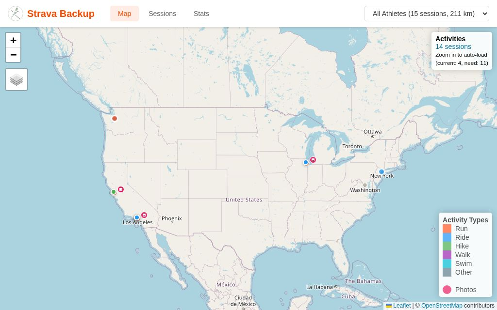
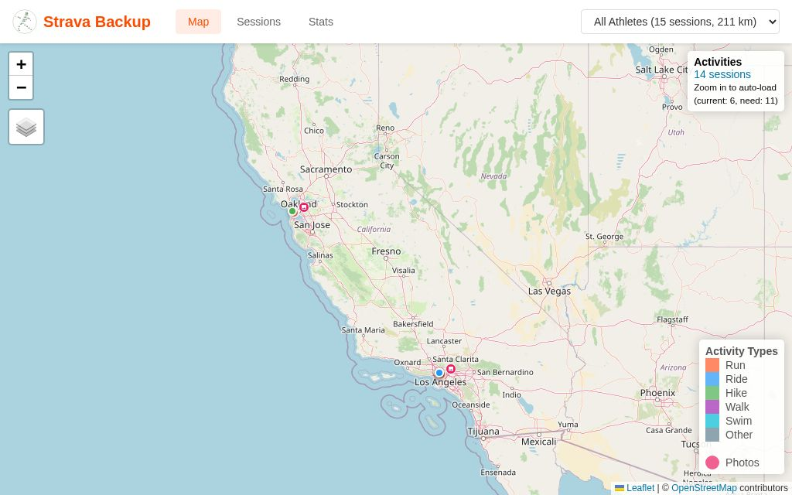
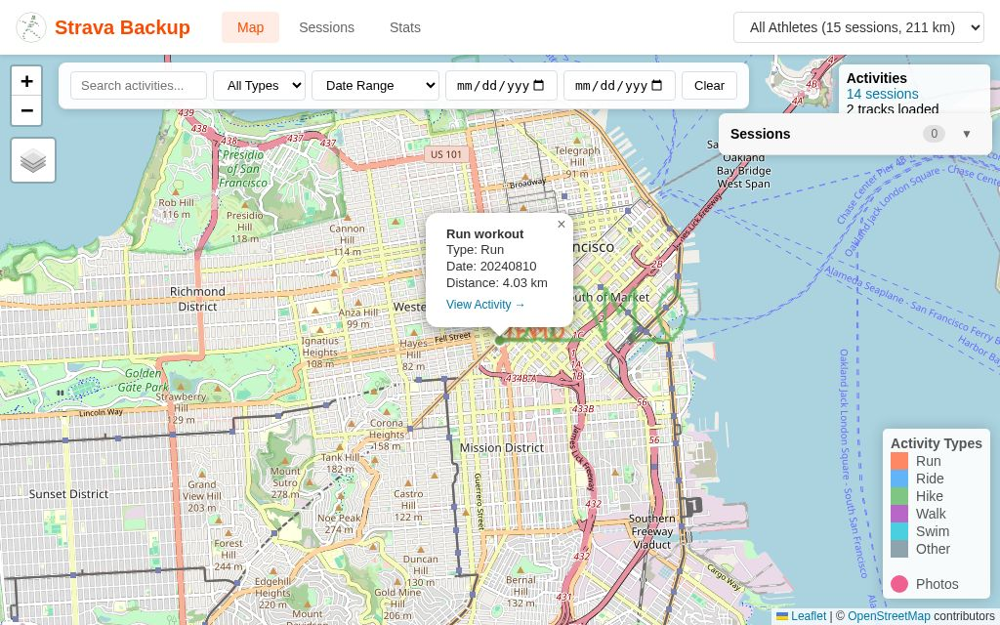
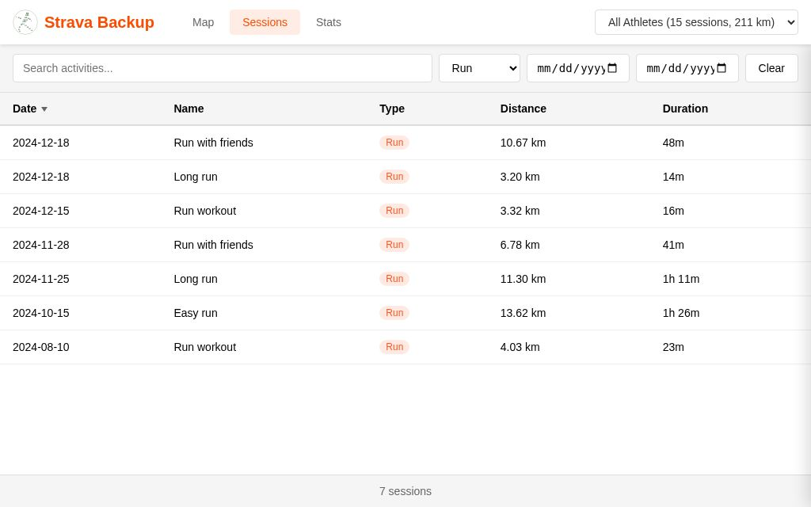
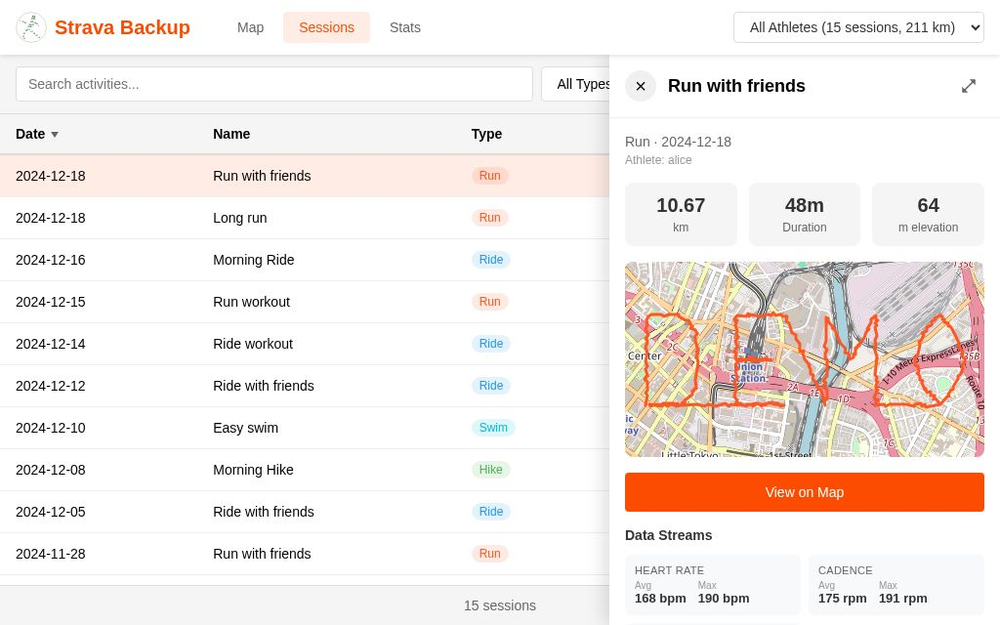
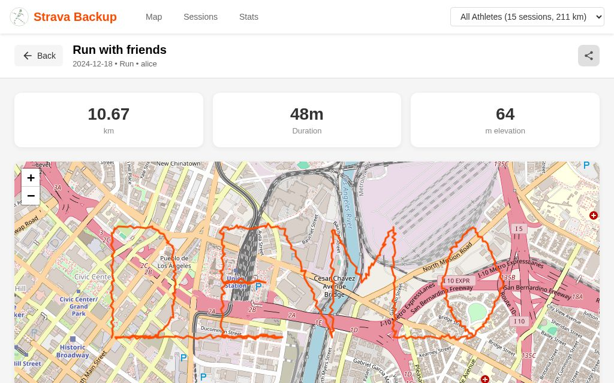
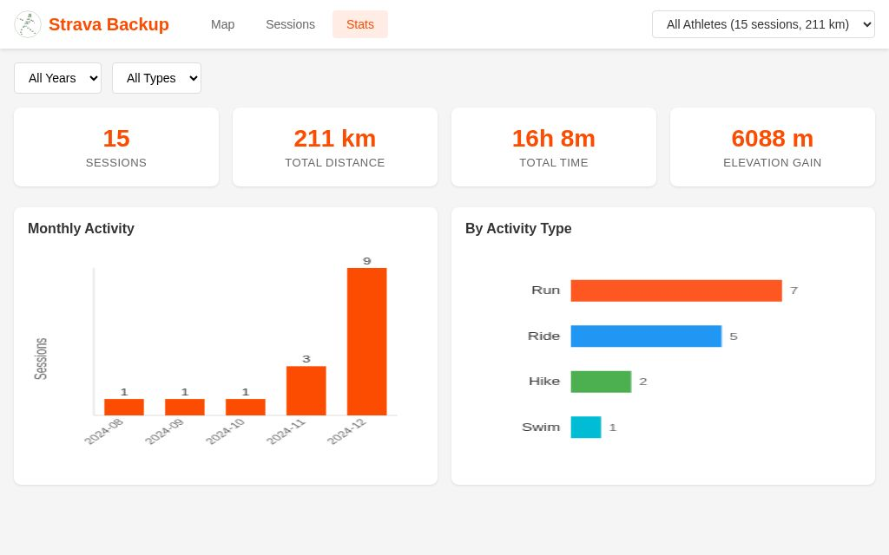
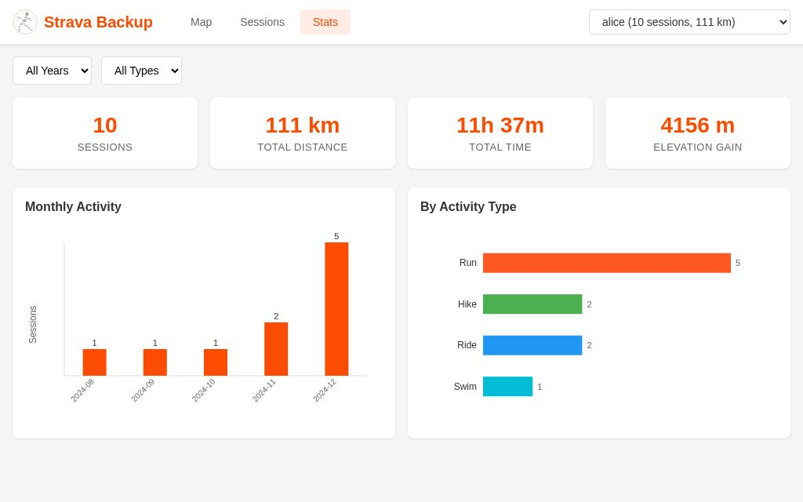

# strava-backup

CLI tool to backup Strava activities with incremental sync, map visualization, and FitTrackee export.

## Features

- **Backup Activities**: Download all your Strava activities including metadata, GPS tracks, photos, comments, and kudos
- **Incremental Sync**: Only fetch new activities after initial backup
- **Interactive Maps**: Generate HTML maps with route visualization and heatmap mode
- **Statistics**: View activity statistics by time period with breakdowns by type
- **Offline Browsing**: Browse your backed-up activities locally without internet
- **FitTrackee Export**: Export activities to self-hosted FitTrackee instances

## Screenshots

The unified web frontend provides a complete activity browsing experience.
Screenshots are auto-generated from the demo dataset (`tox -e screenshots`).

### Map View


*Map view with activity markers*


*Activities zoomed to fit*


*Activity popup with details*

### Sessions View


*Sessions list with filters*


*Sessions filtered by type*


*Session detail panel*

### Session Detail


*Full-screen session view*

### Statistics


*Statistics dashboard*


*Statistics by athlete*

## Installation

```bash
# Clone repository
git clone https://github.com/yourusername/strava-backup
cd strava-backup

# Install with uv (recommended)
uv venv
source .venv/bin/activate
uv pip install -e ".[devel]"

# Or with pip
pip install -e ".[devel]"
```

## Strava API Setup

Before using strava-backup, you need to create a Strava API application:

1. Go to https://www.strava.com/settings/api
2. Click "Create an Application" (or use existing one)
3. Fill in the form:
   - **Application Name**: e.g., "My Backup Tool"
   - **Category**: "Personal"
   - **Website**: "http://localhost" (or your own)
   - **Authorization Callback Domain**: "localhost"
4. After creation, note your **Client ID** and **Client Secret**

## Quick Start

1. Authenticate with your Strava API credentials:
   ```bash
   strava-backup auth --client-id YOUR_CLIENT_ID --client-secret YOUR_CLIENT_SECRET
   ```
   This opens a browser for OAuth authorization. After approval, tokens are saved automatically.

2. Sync your activities:
   ```bash
   strava-backup sync
   ```

3. View your data:
   ```bash
   strava-backup view stats
   strava-backup view map --serve
   strava-backup browse
   ```

## Configuration

strava-backup looks for configuration in the following order:

1. `STRAVA_BACKUP_CONFIG` environment variable (explicit path)
2. `.strava-backup/config.toml` in the current directory (recommended for DataLad datasets)
3. `.strava-backup.toml` in the current directory (legacy, still supported)
4. `~/.config/strava-backup/config.toml`

OAuth tokens are stored separately in `.strava-backup/oauth-tokens.toml` (gitignored).

### Configuration File Format

Create `.strava-backup/config.toml` in your project directory or `~/.config/strava-backup/config.toml`:

```toml
[strava]
client_id = "YOUR_CLIENT_ID"
client_secret = "YOUR_CLIENT_SECRET"
# These are auto-populated after `strava-backup auth`:
# access_token = "..."
# refresh_token = "..."
# token_expires_at = 1234567890

[data]
directory = "./data"  # Where to store backed-up activities

[sync]
photos = true    # Download activity photos
streams = true   # Download GPS/sensor data
comments = true  # Download comments and kudos

[fittrackee]
url = "https://fittrackee.example.com"
email = "your@email.com"
# password can be set via FITTRACKEE_PASSWORD env var
```

### Environment Variables

All settings can be overridden with environment variables:

| Variable | Description |
|----------|-------------|
| `STRAVA_BACKUP_CONFIG` | Path to config file |
| `STRAVA_CLIENT_ID` | Strava API client ID |
| `STRAVA_CLIENT_SECRET` | Strava API client secret |
| `STRAVA_BACKUP_DATA_DIR` | Data storage directory |
| `FITTRACKEE_URL` | FitTrackee instance URL |
| `FITTRACKEE_EMAIL` | FitTrackee login email |
| `FITTRACKEE_PASSWORD` | FitTrackee login password |

## Commands

### Authentication

```bash
# First-time authentication
strava-backup auth --client-id YOUR_ID --client-secret YOUR_SECRET

# Re-authenticate (e.g., after token expiry)
strava-backup auth --force
```

### Sync Activities

```bash
# Incremental sync (default) - only new activities since last sync
strava-backup sync

# Full sync - re-download all activities
strava-backup sync --what=full

# Refresh social data (kudos/comments) for existing activities
strava-backup sync --what=social

# Refresh athlete profile info and avatar
strava-backup sync --what=athlete-profiles

# Sync with limits
strava-backup sync --limit 100

# Preview without downloading
strava-backup sync --dry-run

# Skip photos/comments
strava-backup sync --no-photos --no-comments

# Sync specific activities by ID
strava-backup sync --activity-ids 12345678901,12345678902
```

### View Statistics

```bash
# Overall stats
strava-backup view stats

# Stats for specific year
strava-backup view stats --year 2025

# Stats for specific month
strava-backup view stats --month 2025-06

# Breakdown by month
strava-backup view stats --by-month

# Breakdown by activity type
strava-backup view stats --by-type

# JSON output
strava-backup view stats --json
```

### Generate Maps

```bash
# Create HTML map file (embeds all data)
strava-backup view map --output activities.html

# Create and serve locally
strava-backup view map --serve

# Lightweight mode - generates map.html in data directory that loads data on demand
# Best for large datasets and web server publishing
strava-backup view map --lightweight --serve

# Heatmap mode
strava-backup view map --heatmap --serve

# Include photos on map
strava-backup view map --photos --serve

# Filter by date/type
strava-backup view map --after 2025-01-01 --type Run
```

### Browse Offline

```bash
# Start local browser at http://127.0.0.1:8080
strava-backup browse

# Custom port
strava-backup browse --port 9000
```

### Export GPX

```bash
# Export specific activity
strava-backup gpx 12345678901 --output activity.gpx

# Export all activities
strava-backup gpx --all --output-dir ./gpx/
```

### Export to FitTrackee

```bash
# Export to FitTrackee
strava-backup export fittrackee --url https://fittrackee.example.com --email user@example.com

# Preview what would be exported
strava-backup export fittrackee --dry-run

# Force re-export all
strava-backup export fittrackee --full
```

### Create DataLad Dataset

Create a version-controlled dataset for reproducible backups using [DataLad](https://www.datalad.org/):

```bash
# Create a new DataLad dataset
strava-backup create-datalad-dataset ./my-strava-backup

# Navigate to the dataset
cd my-strava-backup

# Edit config with your Strava API credentials
nano .strava-backup/config.toml

# Authenticate
strava-backup auth

# Sync using datalad run (creates versioned commit)
make sync

# Generate lightweight map for web viewing
strava-backup view map --lightweight
```

This creates a dataset with:
- **text2git configuration**: Text files (JSON, TSV) tracked by git, binary files (photos, Parquet) by git-annex
- **Sample config**: `.strava-backup/config.toml` with comments explaining each setting
- **README**: Documentation for the dataset
- **Makefile**: Targets for `make sync`, `make stats`, `make map`, etc. using `datalad run`

Benefits of DataLad integration:
- Full version history of all backups
- Reproducible sync operations with `datalad run`
- Efficient storage of binary files with git-annex
- Easy to clone and share datasets
- Simple publishing to web servers (see below)

### Publishing to a Web Server

With DataLad, publishing your backup to a web server for browser-based viewing is trivial:

```bash
# Create a sibling that excludes sensitive files (API credentials)
datalad create-sibling -s public-website \
    --annex-wanted "not metadata=distribution-restrictions=*" \
    user@server.example.com:/var/www/strava-backup

# Push your data (sensitive config files are automatically excluded)
datalad push --to=public-website
```

Then access the map visualization at `https://your-server.example.com/strava-backup/map.html`.

**Note**: Access restrictions and user management are outside the scope of this project. Implement access control using your web server's authentication mechanisms (HTTP Basic Auth, OAuth proxy, IP allowlisting, etc.).

## Data Storage

Activities are stored in a Hive-partitioned directory structure:

```
data/
├── athletes.tsv                  # Summary of all athletes
├── map.html                      # Generated map (with --lightweight)
└── athl={username}/
    ├── athlete.json              # Athlete profile data
    ├── avatar.jpg                # Profile photo
    ├── sessions.tsv              # Activity summary (TSV format)
    ├── gear.json                 # Equipment catalog
    └── ses={datetime}/           # Individual activity folder
        ├── info.json             # Activity metadata, comments, kudos
        ├── tracking.parquet      # GPS + sensor data (Parquet)
        ├── tracking.json         # Data manifest
        └── photos/               # Activity photos
            └── 20251218T063500.jpg
```

### Query with DuckDB

```bash
duckdb
```

```sql
-- Activity summary
SELECT sport, SUM(distance_m)/1000 as km, COUNT(*) as activities
FROM read_csv_auto('data/athl=*/sessions.tsv')
GROUP BY sport;

-- GPS track analysis
SELECT ses, AVG(heartrate) as avg_hr, MAX(heartrate) as max_hr
FROM read_parquet('data/**/tracking.parquet', hive_partitioning=true)
WHERE heartrate > 0
GROUP BY ses;
```

## Cron Setup

For automated daily backups:

```bash
# Edit crontab
crontab -e

# Add daily sync at 2 AM
0 2 * * * cd /path/to/strava-backup && .venv/bin/strava-backup sync --quiet
```

## Troubleshooting

### Token Expired
```bash
strava-backup auth --force
```

### Rate Limit Hit
The tool automatically pauses when hitting Strava's rate limits (200 requests/15 minutes, 1000/day) and resumes. For large initial syncs, the process may span multiple days.

### Missing GPS Data
Some activities (treadmill, manual entries) have no GPS. They appear in `sessions.tsv` but not on maps.

### Photo Download Failed
Photo URLs expire. Re-run sync to retry:
```bash
strava-backup sync --full
```

## License

MIT
