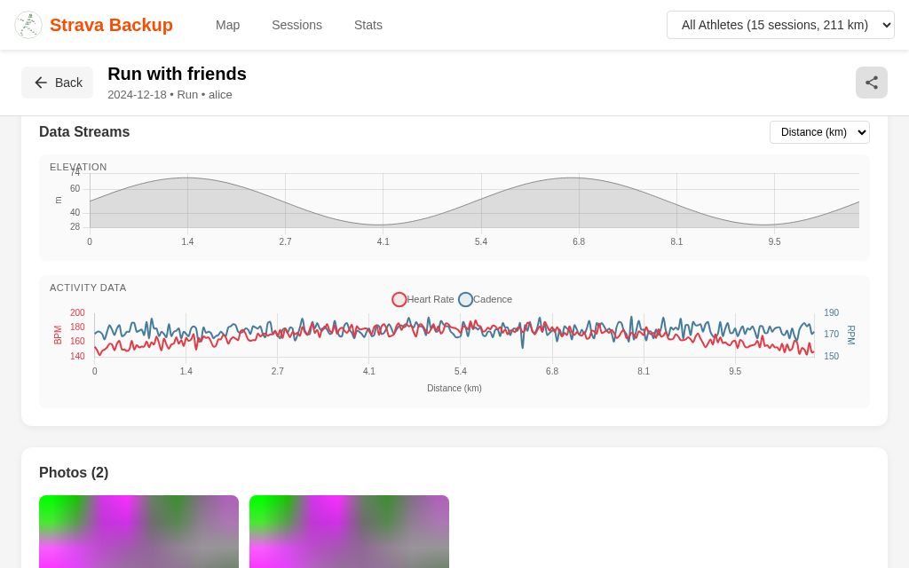
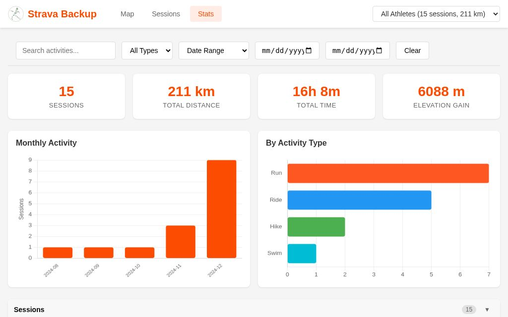
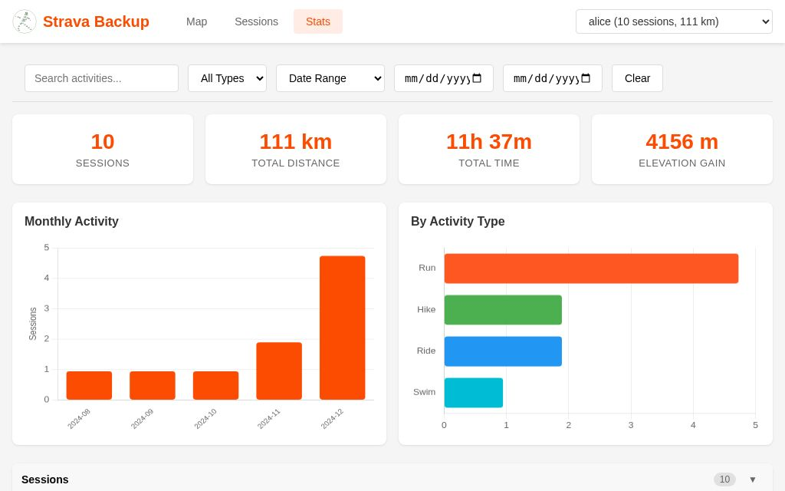

# Exploring Your Data

This tutorial shows you how to use the interactive map browser to explore your fitness activities.

## Starting the Browser

Generate and serve the browser:

```bash
mykrok create-browser --serve
```

This opens `http://127.0.0.1:8080` with your activities.

!!! tip "Offline Use"
    The generated `mykrok.html` file works offline. Just open it directly in your browser.

## The Map View

The map view shows all your activities on an interactive map.


*Map view with activity markers*

### Activity Markers

- Each activity is shown as a colored marker at its starting location
- Colors indicate activity type (blue for rides, green for runs, etc.)
- Click a marker to see activity details

### Viewing Tracks


*Activities zoomed to fit with GPS tracks visible*

Click a marker to:

1. See the activity popup with name, date, distance, and stats
2. View the full GPS track on the map
3. Navigate to photos if available


*Activity popup showing details, photos, and navigation*

### Map Controls

- **Zoom**: Mouse wheel or +/- buttons
- **Pan**: Click and drag
- **Fit bounds**: Click the bounds icon to fit all visible activities
- **Filter to view**: Toggle to show only activities in the current map view

### The Legend

The color legend on the left shows activity types. Click a type to:

- Filter to show only that type
- Click again to show all types

## The Activities Panel

The right panel lists all activities.

### Filtering

Use the filter bar to narrow down activities:

- **Date range**: Select start and end dates
- **Type filter**: Filter by activity type
- **Search**: Search activity names

### Sorting

Activities are sorted by date (newest first).

### Activity Details

Click an activity to:

- Center the map on that activity
- Show the GPS track
- Open the popup with details

## The Sessions View

Switch to Sessions view for a full list of all activities with more details.


*Sessions list with date and type filters*

### Columns

- Date and time
- Activity type
- Name
- Distance
- Duration
- Elevation gain
- Heart rate (if recorded)


*Sessions filtered by activity type*

### Session Details

Click a session to see:

- Full activity metadata
- Sensor data graphs (elevation, heart rate, cadence)
- Photos
- Comments and kudos


*Session detail panel with metadata*


*Full-screen session view*


*Activity data streams: elevation, heart rate, cadence*

## The Stats View

The Stats view shows aggregated statistics.


*Statistics dashboard with charts*

### Charts

- **Distance by type**: Total distance for each activity type
- **Activities by month**: Activity count over time
- **Duration trends**: Time spent exercising

### Filtering

Use the filter bar to see stats for specific date ranges or activity types.


*Statistics filtered by athlete*

## URL Sharing

The browser preserves state in the URL, so you can:

- Share a link to a specific activity
- Bookmark filtered views
- Return to where you left off

### URL Parameters

- `view=map|sessions|stats` - Current view
- `from=YYYY-MM-DD` - Start date filter
- `to=YYYY-MM-DD` - End date filter
- `type=Run,Ride` - Activity type filter
- `track=username,datetime` - Selected track
- `vp=1` - Viewport filter enabled

## Keyboard Shortcuts

When viewing photos:

- **Left/Right arrows**: Navigate between photos
- **Escape**: Close photo viewer

## Tips

### Finding Activities

1. Use the search box to find activities by name
2. Use date filters to narrow down time periods
3. Use the "filter to view" toggle to see only activities in the current map area

### Comparing Activities

1. Filter to a specific route or area
2. Compare dates and times
3. Look at pace/speed trends over time

### Identifying Patterns

1. Use the Stats view to see monthly trends
2. Filter by activity type to focus on specific training
3. Look at elevation profiles for route analysis
